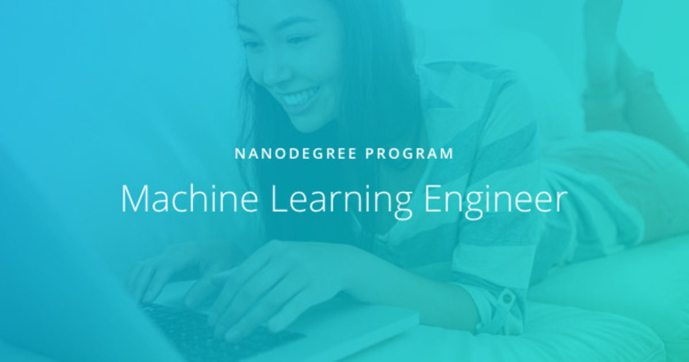

# Machine Learning Engineer Nanodegree

Period: 28 August 2019 - 28 November 2019 (Ongoing)

 

**Objectives:** Build predictive models using a variety of unsupervised and supervised machine learning techniques. Understand cloud deployment terminology and best practices. Use Amazon SageMaker to deploy machine learning models to production environments, such a as web application or piece of hardware. A/B test two different deployed models and evaluate their performance. Utilize an API to deploy a model to a website such that it responds to user input, dynamically. Update a deployed model, in response to changes in the underlying data source.

More information, visit the [Udacity Machine Learning Nanodegree webpage](https://www.udacity.com/course/machine-learning-engineer-nanodegree--nd009t).

 

**Projects:**

- *Machine Learning in Production. Deploy a Sentiment Analysis Model.*

  Deploy, using Sagemaker, a PyTorch sentiment analysis model to recognize the sentiment of movie reviews (positive or negative).

  - [Project](https://github.com/JrVerbiest/Udacity_Machine_Learning_Engineer_Nanodegree/tree/master/Deployment%20Project%20Sentiment%20Analysis) and [review from Udacity](https://github.com/JrVerbiest/Udacity_Machine_Learning_Engineer_Nanodegree/blob/master/Deployment%20Project%20Sentiment%20Analysis/Deployment%20Project%20Sentiment%20Analysis%20Review.md)

- *Machine Learning Case Studies. Plagiarism Detector.*

  Engineer features that can help identify cases of plagiarism in text and deploy a trained plagiarism detection model using Amazon SageMaker.

  - [Project](https://github.com/JrVerbiest/Udacity_Machine_Learning_Engineer_Nanodegree/tree/master/Plagiarism%20Detection) and [review from Udacity](https://github.com/JrVerbiest/Udacity_Machine_Learning_Engineer_Nanodegree/blob/master/Plagiarism%20Detection/Plagiarism%20Detector%20Review.md)

- *Machine Learning Capstone Project*

  A final project that involves data exploration and machine learning.
  
  - [About](https://github.com/JrVerbiest/Udacity_Machine_Learning_Engineer_Nanodegree/blob/master/Capstone%20Project/README.md)
  - [Project Proposal](https://github.com/JrVerbiest/Udacity_Machine_Learning_Engineer_Nanodegree/blob/master/Capstone%20Project/Proposal.pdf)
  - [Project Report](https://github.com/JrVerbiest/Udacity_Machine_Learning_Engineer_Nanodegree/blob/master/Capstone%20Project/Report.pdf)

 

---

*Last update: 15 November 2019*